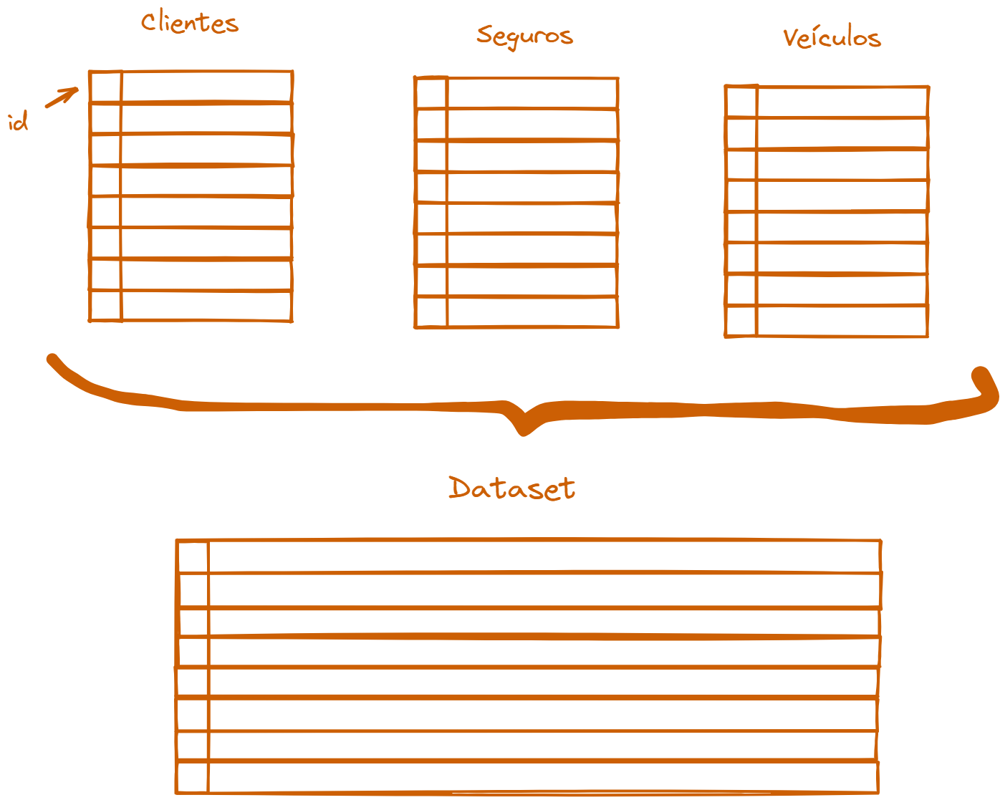
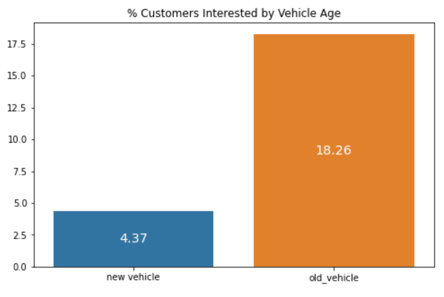
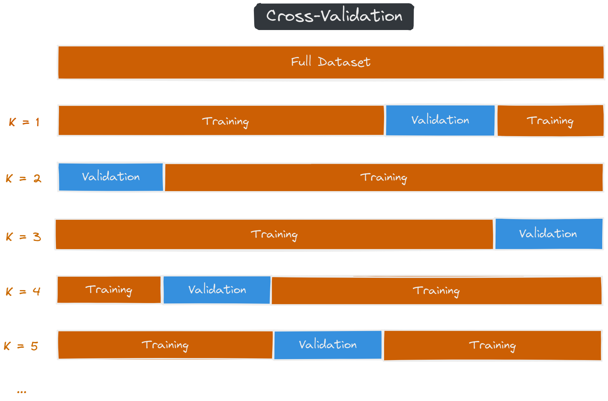
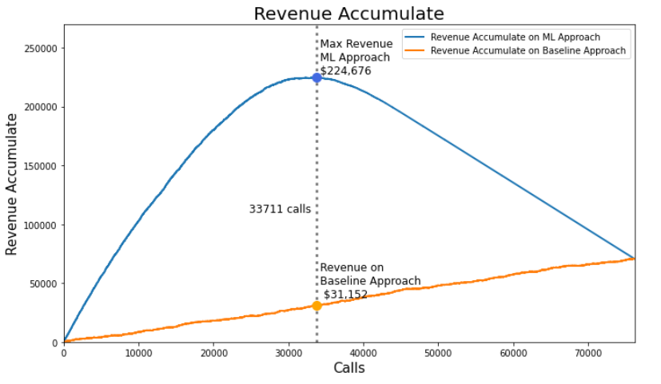

# Insurance-Cross-Sell

 

# Problema de Negócio
  

  
A All Insurance é uma empresa fictícia que oferece serviços de seguro de saúde a seus clientes há mais de 10 anos em todo o mundo. Buscando ampliar seu espectro de atuação, a empresa deseja agora oferecer à sua base de clientes um **seguro de automóveis.** 

Para isso, foi realizada uma pesquisa com aproximadamente 381 mil clientes à fim de entender quais apresentavam interesse ou não em adquirir o novo seguro. Esses dados foram então armazenados em um banco de dados e agora a empresa possui uma base de 127 mil novos clientes aos quais deseja ofertar o novo seguro.

 
  

  

  
O plano é alocar parte do time de vendas para **contactar esses clientes via telefone** ofertando o seguro. Dado a número de vendedores e ao orçamento destinado ao projeto, a equipe tem a capacidade de realizar até 20 mil ligações para a base de potenciais clientes.

Com essa restrição de projeto, a All Insurance gostaria de **atingir o maior número possível de interessados** no seguro dentro do limite de ligações possíveis.
  
Para isso, ela contratou um time de cientistas de dados para que estes pudessem selecionar os melhores clientes dentre a base potencial para o oferecimento do seguro.
  
 

# Estratégia de Solução

Tendo como base a pesquisa de interesse realizada pela empresa à respeito do novo seguro, que reuniu diversos dados dos potenciais clientes, o modelo proposto neste projeto será capaz de **calcular a probabilidade (score) de um determinado indivíduo aderir um seguro ou não**.

Por exemplo, entre um cliente A com probabilidade de aderir ao seguro de 20% e outro cliente B com probabilidade de 70%, o **time de vendas deveria optar por acionar primeiramente o cliente B**. Com a probabilidade de aderência do seguro calculada para todos os clientes da base potencial, é possível ordenar a lista pela probabilidade, da maior para a menor, e acionar primeiramente os clientes com maior probabilidade, aumentando assim a conversão da operação.

A imagem a seguir procura ilustrar esse processo:
 

 

 # Planejamento da Solução

Em uma visão geral, o processo de solução deste problema foi elaborado da seguinte forma

1. Primeiro os dados da pesquisa de interesse realizado pela empresa foram dividos em duas parcelas, uma com 80% dos dados e outra com 20%. Esses dados foram utilizados para treinar e avaliar o algoritmo em um processo de cross validation, treinando-se o algortmo com a parcela maior e avaliando suas métricas com a menor
2. Após essa avaliação, foi feita a escolha do algoritmo a ser utilizado no projeto 
3. Com o modelo escolhido e os hiperparametros ajustados, a base de novos clientes e aplicada ao modelo para a obtenção das probabilidades e o ordenamento da lista para o time de vendas
4. Assumindo que as bases sejam homogênas, podemos generalizar as métricas obtidas na validação do modelo para a nova base de clientes, mensurando-se assim a performance da operação com essa nova base

Esse processo pode ser ilustrado pela imagem a seguir:
  

 

# Desenvolvimento

## 1. Coleta de Dados

Foi realizada uma consulta no banco de dados para coletar os dados referentes à pesquisa feita pela empresa com sua base de clientes.

O banco possui 3 tabelas com informações dos clientes, veículos e seguros, respectivamente. Foi feito o cruzamento dessas 3 tabelas pela chave única existente, sendo o resultado desse cruzamento a fonte principal dos estudos desse projeto

 

## 2. Descrição dos Dados

Na tabela resultante da consulta realizada possui cerca de 381.109 registros e 12 atributos diferentes de cada cliente. Os atributos são descritos à seguir:

| Store              | Sales      
| ------------------ | ---------- 
|id	                 | Identificador único de cada cliente
|Gender	             | Gênero do cliente
|Driving_License	   | 0 : Cliente não tem carteira de motorista, 1 : Cliente possui carteira de motorista
|Region_Code         | Identificador único da região
|Previously_Insured	 | 1 : Cliente já possui seguro veicular, 0 : Cliente não possui seguro veicular
|Vehicle_Age	       | Idade do veículo
|Vehicle_Damage	     | 1 : Cliente já teve seu carro daniicado anteriormente. 0 : Cliente nunca teve seu carro danificado
|Annual_Premium	     | Valor a ser pago anualmente para aderir o seguro
|PolicySalesChannel	 | Identificador do canal em que foi realizado a pesquisa (email, telefone, etc..)
|Vintage	           | Total de dias que o cliente está associado à companhia
|Response	           | 1 : Cliente está interessado no seguro veicular, 0 : Cliente não está interessado

## 3. Criando Novos Atributos

Em todos os ciclos de desenvolvimento desse projeto, não vimos necessidade de criar novos atributos para o modelo. Foi feito alguns ajustes que visam facilitar a visualização nos atributos já existentes como ajuste dos nomes das categorias.

## 4. Análise Exploratória de Dados

Foi realizada uma análise exploratória dos dados a fim de entender alguns de seus comportamentos e distribuições. Neste processo, alguns insights foram gerados, o 3 principais foram:

#### 1) Clientes com mais de 40 anos de idade são, em média, 50% mais interesados em aderir ao seguro

- **Falso,** clientes com mais de 40 anos são 95% mais interessados no seguro:
- 

 

 

#### 2) Clientes com carros mais novos são 30% mais interessados em adiquirir o seguro que clientes com carros mais antigos

- ******Falso,****** clientes mais novos são 76% menos interessados no seguro.

 

 

#### 3) Quanto mais dias o cliente tiver de relação com a companhia, maiores as chances dele estar interessado no seguro

- ************Falso,************ quanto mais tempo o cliente tiver de relacionamento com a compania, menor é o interesse no seguro.

 

## 5. Preparação dos Dados

A fim de preparar os dados para o modelo, foram aplicadas as seguintes transformações

- Standarization: Para variáveis numéricas com distribuição bem próxima à normal.
- Min Max Scaler: Para variáveis numéricas com distruibuição diferente da normal e sem outliers.
- One Hot Enconde: Para variáveis categóricas que represetem uma ideia de estado.
- Target Encode: Para variáveis categóricas em que se espera que sua média em relação à variável resposta seja constante.
- Frequency Enconde: Para variáveis categóricas em que se entende que sua frequencia tem relação com a variável resposta.

 

## 6. Seleção de Atributos para o Modelo

Para avaliar quais features possuem maior contribuição na predição da variável resposta e então selecionar as melhores features para o modelo, foi utilizado o critério de **importancia das árvores** com uma Random Forest. Foram encontradas as seguintes importancias:

 

Com isso, as selecionadas as 7 features mais importantes para o modelo:

- Vintage
- Annual Premium
- Age
- Region Code
- Vehicle Damage
- Police Sales Channel
- Previuously Insured

## 7. Modelo de Machine Learning

Para a definição do melhor modelo a ser utilizado, foram testados 5 modelos de classificação diferentes. Estes foram avaliadas principalmente pelas métricas de rankeamento (ponto chave desde projeto) mas também as métricas de classificação em si.

As principais métricas observadas foram:

- Precision at K
- Recall at K

Também foram observadas as métricas de Classificação:

- Acurácia
- Precisão
- Recall
- F1 Score

Para avaliar as métricas de todos os modelos testados de um forma mais fidedigna, foi utilizada a técnica de Cross Validation

Neste processo, o modelo é treinado e validado com diferentes segmentos do dataset disponível a fim de reduzir qualquer viés que possa ocorrer durante a separação dos dados para o treino. Esse funcionamento pode ser ilustrado à seguir:

 

As métricas de rankeamento de todos os modelos testados são mostradas à seguir:

| Model                | Precision at K      | Recall at K     
| -------------------- | ------------------- | --------------------
| KNN                  | 0.2188 +/- 0.0009   | 0.9370 +/- 0.0039
| Logistic Regression  | 0.2320 +/- 0.0002   | 0.9935 +/- 0.0039
| Extra Trees          | 0.2286 +/- 0.0003   | 0.9792 +/- 0.0016
| XGBoost              | 0.2322 +/- 0.0002   | 0.9943 +/- 0.0010
| Light LGBM           | 0.2331 +/- 0.0002   | 0.9940 +/- 0.0011

Com base nessas métricas, o modelo escolhido para esse projeto foi o **XGBoost Classifier**

## 8. Ajuste dos Hiperparametros do Modelo

O ajuste dos hiperparametros do modelo escolhido foi realizado através do método do otimização Baysiana (Baysian Optimazation). 

De uma forma resumida, dada uma função objetivo (que neste trabalho foi a maximização da acurácia do modelo) este método busca o **ótimo global** aproximando a função real de hiperparametros por uma “falsa” função chamada função substituta. 

A vantagem deste método é que ele utilizada o resultado das iterações anteriores para decidir os passos futuros, mudando ou mantendo a estratégia a depender da variação da função objetivo a cada iteração. Um pouco mais sobre esse método pode ser encontrado no [link](https://medium.com/analytics-vidhya/hyperparameter-search-bayesian-optimization-14be6fbb0e09).

Para essa aplicação foi utilizada a biblioteca optuna. Os resultados das iterações do método até sua convergência são mostrados a seguir:

 

# Resultados de Negócio

Para mensurar os impactos financeiros desse projeto, foi feita uma análise sobre a perspectiva do lucro obtido com a operação comparando duas abordagens, a primeira sem a utilização do modelo e a ordenação dos clientes e a segunda com a ordenação dada pelo modelo.

Essa análise foi baseada em algumas premissas:

- O lucro obtido pela operação é igual à receita obtida de cada cliente convertido subtraida do custo de aquisição de cliente
- Assumimos aqui valores fictícios e fixos para a receita e custo de aquisição dos clientes como sendo de 40 unidade monetárias (u.m) e 4 u.m respectivamente.

O resultado dessa análise pode ser observada no gráfico abaixo

 

### Conclusões

- A performance da operação é muito superior com a ordenação do base pelo modelo em relação ao método tradicional sem ordenação.
- Apesar da capacidade da equipe de vendas ser de 20 mil ligações, com as premissas assumidas aqui, a quantidade de ligações que maximiza o lucro é de 31.156 ligações

Fazendo 20 mil ligações, a companhia terá um ganho financeiro de $141.299 acima da abordagem tradicional

 

# Modelo em Produção

Para o acesso to time de negócios e vendas aos resultados do modelo, foi construída uma API que retorna o valor de probabilidade (propensity score) de conversão do cliente de interesse 

Basicamente, a partir dos dados dos clientes informados pelo usuário ou aplicação, o arquivo [Handler](http://Handler.py) carrega as transformações necessárias aos dados e o modelo já treinado. Então, faz-se a predição e esse valor e retornado ao usuário.

O funcionamento básico da API é demosntrado a seguir:

 

A fim de facilitar o acesso do time de vendas e de negócios aos dados, foi construída uma [planilha no Google Sheets](https://docs.google.com/spreadsheets/d/1iOERg99eXRlAgLsPzGxkGd__afzRs_0Vs_LMovph7ck/edit?usp=sharing) que realiza a predição dos clientes desejados de uma forma bem simple:

1. Os dados da nova base de clientes é inserido na planilha do google sheets pelo usuário
2. Foi criado um botão no menu superior chamado “propensity score” que quando clicado gera o score de todos os clientes inseridos na planilha
3. Com os scores de todos os clientes, o time poderá iniciar sua operação

A imagem à seguir demonstra o funcionamento dessa planilha:

 

# Próximos passos

Como próximos passos e melhorias para a evolução desse projeto, elencou-se os seguintes pontos:

- Coleta de novas features que possam ser relevantes para a predição da conversão do cliente.
- Criação de novas features a partir das features já existentes, que ajudem na modelagem do fenômeno.
- Facilitar o acesso ao time de vendas às predições do modelo, melhorando a usabilidade da planilha compartilhada por meio de botões, instruções e seleções das features
